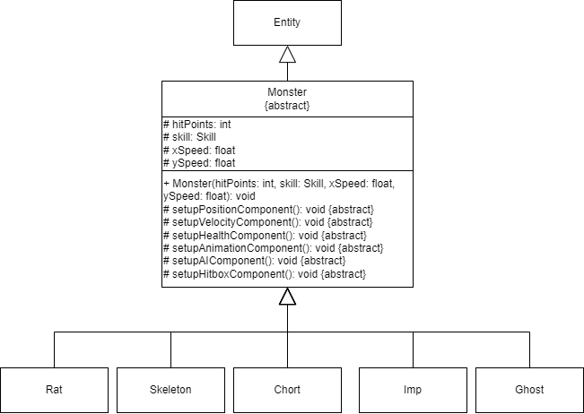

Titel: Konzeptskizze für Zyklus 1

Author: Bent Schöne, Marvin Petschulat, Edwin Dik

---
## Beschreibung der Aufgabe

5 Gegner
- Ratte
- Skeleton
- Imp (Texturen vorhanden)
- Chort (Texturen vorhanden)
- Geist (schwer)

---

## Beschreibung der Lösung

### Eigenschaften der Monster
Ratte

| Verhalten | Leben | Geschwindigkeit | Wander Verhalten   |
|-----------|-------|-----------------|--------------------|
| Passiv    | 1HP   | 0.1             | durchs ganze level |

Skeleton

| Verhalten | Leben | Geschwindigkeit | Angriff           | Schaden | Wander Verhalten        |
|-----------|-------|-----------------|-------------------|---------|-------------------------|
| Aggresiv  | 3HP   | 0.5             | Fernkampf (Bogen) | 1HP     | in einem kleinen Radius |

Imp

| Verhalten | Leben | Geschwindigkeit | Angriff                | Schaden | Wander Verhalten        |
|-----------|-------|-----------------|------------------------|---------|-------------------------|
| Aggresiv  | 2HP   | 0.15            | Fernkampf  (Feuerball) | 1HP     | in einem kleinen Radius |

Chort

| Verhalten | Leben | Geschwindigkeit | Angriff  | Schaden | Wander Verhalten   |
|-----------|-------|-----------------|----------|---------|--------------------|
| Aggresiv  | 4HP   | 0.15            | Nahkampf | 2HP     | durchs ganze level |

Geist

| Verhalten | Leben | Geschwindigkeit | Angriff                     | Schaden | Wander Verhalten   | Besonderheit                                                     |
|-----------|-------|-----------------|-----------------------------|---------|--------------------|------------------------------------------------------------------|
| Passiv    | 2HP   | 0.25            | Nahkampf und Kontaktschaden | 1HP     | durchs ganze level | Kann durch Wände Fliegen und wird unsichtbar außerhalb vom Level |

### Einbindung der Monster

Ebenen System. Desto tiefer desto schwerer. Mehr Monster stärkere Monster

| ab Ebene 1 | ab Ebene 3  | ab Ebene 6            | ab Ebene 10         |
|------------|-------------|-----------------------|---------------------|
| Ratten 0-2 | Geister 1-2 | Skelette und 1-2 Imps | Imps und Chorts 1-4 |

---

## Methoden und Techniken

Aus Vorlesung: Methoden Referenzen, Lamda, Git, Javadoc, Streams

Vlt Pattern Strategy

### AISystem Erklären
Um ein Monster eine AI zu geben, muss man folgendes festsetzen:
- FightAI
  - Wie sich das Monster verhalten soll, wenn es den Spieler angreifen soll
    - `CollideAI`: Rennt den Spieler an bis es in einer gegebenen Range ist
    - `MeleeAI`: Benutzt den gegebenen Skill, wenn der Spieler in einer gegebenen Range ist
- IdleAI
  - Wie sich das Monster verhält, wenn kein Spieler in der Nähe ist
    - `PatrouilleWalk`: Wandert um n viele Punkte in einem Umkreis
    - `RadiusWalk`: Wandert in einem Radius. Der Startpunkt kann sich dabei ändern
    - `StaticRadiusWalk`: Wander in einem Radius. Der Startpunkt ist fest
- TransitionAI
    - Ab wann das Monster aggresiv wird
      - `RangeTransition`: Das Monster wird aggresiv, wenn der Spiele in einem gegebenen Radius ist
      - `SelfDefendTransition`: Das Monster wird nur aggresiv, wenn es schaden erleidet

### Spawning "System"

In der Klasse `game/src/starter/Game.java` existiert eine Methode `onLevelLoad()`
die jedes Mal ausgeführt wird wenn ein Neues Level geladen wird. Dort können wir den Code einbauen, der
eine Zufällige anzahl und typen an Monster Spawnen lässt. Dabei soll die Stärke und Häufigkeit der Monster
abhängig von der Tiefe sein.

Für die Tiefe müssen wir eine neue Variable einfügen die Hochzählt jedes Mal wenn die Mehtode `onLevelLoad()`
in `Game.java` ausgeführt wird.

Mithilfe der Methode `addEntity(Entity entity)` in `Game.java` können alle Monster hinzufügt werden die im Level erscheinen sollen.

---

## Ansatz und Modellierung

