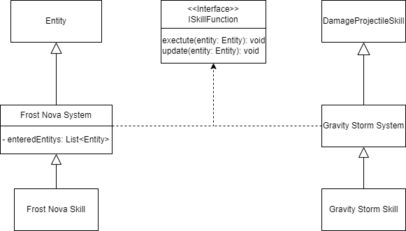

Titel: Konzeptskizze für Zyklus 2

Author: Bent Schöne, Marvin Petschulat, Edwin Dik

---

## Beschreibung der Aufgabe

Implementierung von zwei Fähigkeiten/Zaubersprüchen, welche der Spieler nutzen kann. Die Fähigkeiten/Zauber sollen
keinen Schaden verursachen, sondern Monster anderweitig manipulieren. Die Fähigkeiten sollen außerdem eine Form von
Ressourcenkosten haben, wie z.B. Lebenspunkte, Ausdauerpunkte oder Mana-Punkte.

Abgesehen davon soll noch der Levelaufstieg mit dem bereits vorgegebenen XP-System implementiert werden. Mit jedem Level
sollen die Charakterwerte des Helden erhöht werden und der Held soll weitere Zaubersprüche/Fähigkeiten erlernen können.

Zusätzlich soll das bereits vorhandene Skill-System, der Feuerball-Skill und das XP-System
analysiert und die Funktionalität erklärt werden.

---

## Beschreibung der Lösung

Frost Nova:

| Kosten      | Cooldown | Freigeschaltet ab | Verhalten                  | Effekt             | Hotkey |
|-------------|----------|-------------------|----------------------------|--------------------|--------|
| 2 Mana (MP) | 10 sec   | LVL 5             | Eis Kreis unter dem Helden | Verlangsamt um 30% | 1      |

Gravity Storm:

| Kosten      | Cooldown | Freigeschaltet ab | Verhalten                | Effekt               | Hotkey |
|-------------|----------|-------------------|--------------------------|----------------------|--------|
| 5 Mana (MP) | 30 sec   | LVL 10            | Langsam fliegender Sturm | Zieht Gegner in sich | 2      |

Neue hotkeys werden in dungeon_configs.json hinzugefügt.

### Mana Implementierung

In der Klasse SkillComponent werden zwei neue Variablen `int maxMana` und `int currentMana` hinzugefügt. Diese werden
für alle Skills benutzt. Jede sekunde wird 1 Mana regeneriert. `maxMana` Skaliert mit dem Hero level.

Wir haben uns überlegt das alle Skills wie Feuerball und Spark auch Ressourcenkosten bekommen.
(Feuerball = 1 MP, Spark = 3 MP).

### XP-System

Das XP-System holt sich von allen Entities im Spiel dessen XPComponent. Ist von einem
Entity die benötigte XP erreicht, um einen LevelUp durchzuführen, so wird die
performLevelUP() Methode im XP-System aufgerufen.

In dieser Methode wird das level von dem Entity erhöht. Danach wird die XP vom Entity auf
`xpLeft` gesetzt. Als Letztes wird die LevelUp Methode von der Entity aufgerufen.

### XP-Component

Der XP-Component verwaltet, wie viel XP ein Entity braucht, um in das nächste Level (Hero Level nicht Dungeon Level)
aufzusteigen oder wie viel XP ein Entity "fallen lässt", wenn er besiegt wird. Bei einem LevelUp wird mit der Formel:
`neededXP = 0.5 * currentLevel^2 + 100` die für das nächste Level benötigte Anzahl an XP berechnet.

Wenn ein Entity besiegt wird, dann wird mit der Methode getLootXP() die Anzahl an XP
übergegeben die dieser Entity fallen gelassen hat. Wenn der Entity keine XP fallen lässt (lootXP == -1),
dann wird die Hälfte der `currentXP` des Helden übergeben.

---

### Skill-System

In der Klasse SkillSystem wird jeden Frame die Methode update() ausgeführt. Diese methode reduziert alle cooldowns
für alle Skills.

### Skill-Component

In der Klasse SkillComponent wird eine Liste aus Skills gespeichert. Diese Liste kann mit der Methode `addSkill`
um einen Skill erweitert werden oder mit `removeSkill` um einen Skill verringert werden. Von allen Skills wird der
cooldown mit hilfe der Methode reduceAllCoolDowns() in SkillComponent vom SkillSystem reduziert.

#### Beispiel Skill: Feuerball

Um den FireballSkill zu erstellen, wird in dem Konstruktor der Oberklasse DamageProjectileSkill:

- Der Path der Texturen
- Die Geschwindigkeit
- Der Schadenstyp und Wert
- Die Position
- Das Ziel des Projektils
- Die Reichweite

des FireballSkills übergeben.

---

## Ansatz und Modellierung

Im PlayableComponent und in der MeleeAI gibt es Skill Variablen die speichern welche Skills die Entitäten haben.
Wir haben uns überlegt diese variablen zu entfernen, und dafür ein SkillComponent hinzuzufügen der alle Skills speichert.

Weil beide unserer Skills und potentielle zukünftige Skills jeden Frame geupdated werden müssen haben wir uns überlegt
in dem Interface `ISkillFuncion` eine update() Methode hinzuzufügen. Diese Methode wird dann in der Game Klasse
jeden Frame aufgerufen.

Back Hole System:
- execute()
  - neues Projektil erstellen
- update()
  - alle Entities in der nähe an sich ran ziehen

Frost Nova System:

- execute()
  - Neuen Entity mit Hitbox erstellen
  - Bei iCollideEnter wird die Entity ge-slowed und in einer Liste gespeichert
  - Bei iCollideLeave wird die Entity wieder schneller gemacht und aus der Liste entfernt
- update()
  - Eine Variable die bestimmt wie lange die Frostnova existiert. Diese wird jeden Frame
    reduziert. Wenn sie bei 0 angekommen ist, werden alle Entities in der Liste schneller gemacht
    und die Frost Nova entfernt

---

## UML

