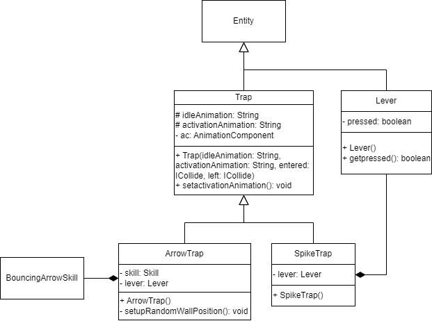

# Fallen

Titel: Konzeptskizze für Zyklus 3

Author: Bent Schöne, Marvin Petschulat, Edwin Dik

---
## Beschreibung der Aufgabe

Es sollen 2 neue Fallen im Dungeon implementiert werden.

Eine Falle kann von dem Hero oder einem Monster ausgelöst werden. Dabei können die Fallen
verschiedene Funktionen haben.

Manche Fallen können auch durch Schalter deaktiviert werden.

---

## Beschreibung der Lösung

Implementiert wird eine Spikefalle, die Schaden verursacht, wenn der Spieler drüber läuft. Die Spikefalle kann durch
einen Hebel im Level deaktiviert werden. Dabei verursacht die Spikefalle 2 Schaden, wenn sie zum ersten Mal ausgelöst
wurde und 1 Schaden wenn man nochmal drüber läuft. Damit der Spieler nicht mehrmals in einer kurzen Zeit von der gleichen Spikefalle, Schaden
bekommt, wird ein Cooldown implementiert.

Die zweite Falle ist eine Pfeilfalle, die einen Pfeil schießt, wenn der Spieler davor rennt. Die Pfeilfalle benutzt den vorhandenen
``BouncingArrowSkill`` um einen Pfeil zu schießen. Der Pfeil verursacht 3 Schaden und hat einen Cooldown von 2 Sekunden.

---

## Methoden und Techniken

Methoden werden wieder gemäß der Vorlesung mit Javadoc dokumentiert.

Für die Versionskontrolle wird Git verwendet.

Logging wird schon durch die Klasse ``Entity`` übernommen, wenn eine neue Falle erstellt wird.

---

## Ansatz und Modellierung

Es wird eine neue Oberklasse ``Trap`` erstellt, welche von der Klasse ``Entity`` erbt. Diese Klasse kümmert sich darum,
die Entities und alle nötigen Components zu erstellen.

#### Spikefalle
Um die Spikefalle zu implementieren, erstellen wir eine neue Klasse ``SpikeTrap``, die von der Klasse ``Trap`` erbt.
Im Konstruktor von Spiketrap wird eine neue ICollide Lambda Funktion erstellt. Diese Funktion definiert, wie und wann die
Spikefalle Schaden verursacht.

#### Pfeilfalle
Für die Pfeilfalle erstellen wir eine neue Klasse ``ArrowTrap``, die von der Klasse ``Trap`` erbt.
Im Konstruktor der Arrowtrap wird eine neue ICollide Lambda Funktion erstellt. Diese Funktion entscheidet, wann die Pfeilfalle
ein Pfeil schießt. Außerdem wird die Methode ``setupRandomWallPosition()`` aufgerufen.

Wir haben uns überlegt, dass die Pfeilfalle ein langes Rechteck als Hitbox hat, um zu prüfen, wann der Spieler vor die Pfeilfalle rennt.
Um unsere Idee umzusetzen, erstellen wir eine neue Methode ``setupRandomWallPosition()``, die, die Position von der Pfeilfalle auf eine zufällige Wand setzt
und die Blickrichtung der Falle definiert. Die Größe der Hitbox wird dann so gesetzt, dass die Hitbox ein langes Rechteck in Blickrichtung der Falle ist.

#### Schalter
Um einen Schalter zu implementieren, erstellen wir eine neue Klasse ``Lever``, die von Entity erbt.
Im Konstruktor wird ein neuer Entity mit AnimationComponent, PositionComponent und InteractionComponent erstellt.
Zudem wird die Position vom Schalter mit der neuen Methode auf eine zufällige Wand gesetzt.
Der Schalter hat außerdem eine boolean Variable, die sich auf true setzt, wenn der Schalter vom Spieler betätigt wird.

---

## UML

