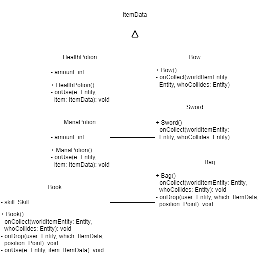

Titel: Konzeptskizze für Zyklus

Author: Bent Schöne, Marvin Petschulat, Edwin Dik

---
## Beschreibung der Aufgabe

Es sollen drei verschiedene Typen von Gegenständen im Dungeon implementiert werden, die der Spieler verwenden kann.

Darüber hinaus sollen Taschen implementiert werden, die das Inventar des Spielers um mehrere Inventarplätze
erweitern sollen, die Taschen sollen dabei selbst einen Inventarplatz belegen und können auch nur eine
begrenzte Anzahl an Gegenständen eines Typus aufbewahren.

Außerdem sollen alle Gegenstände grafisch dargestellt werden.

---

## Beschreibung der Lösung

Implementiert werden Bücher, die ein Skill besitzen, die der Spieler dann benutzen kann.
Unterschiedliche Schwerter und Bögen die den Damage vom Skill definieren. Manatrank und Heilungstrank
die dem Spieler Mana wiedergeben und heilen.

Die Bücher werden schon vorhandene Skills benutzten. Manche Skills können erst ab einen bestimmten Hero level
gefunden werden. Feuerball und Spark können ab Hero level 0 gefunden werden. Frost Nova kann erst ab Hero level 5 gefunden
werden und Gravity Storm ab Hero level 10.

Das Inventar wird durch ein Hotkey (I) geöffnet und pausiert das Spiel. Danach wird das
Inventar in der Konsole ausgegeben. Dann kann man einzelne Items benutzten oder fallen lassen.

Der Spieler bekommt ein Inventar mit 3 Inventar plätze, ein Equipment slot für ein Schwert oder Bogen und 2 Skillslots
für Bücher.

Items können durch eine Kiste im Level gefunden werden. Jedes level hat eine Kiste.

### Beschreibung von ItemData
ItemData definiert wie das Item auf dem Boden und im Inventar aussieht, welches art von
Item es ist (ItemType) und was passieren soll, wenn es aufgehoben, benutzt und fallen gelassen wird.

Es gibt 3 verschiedene ItemTypen: Basic, Active und Passive. Basic items haben keine speziellen Eigenschaften.
Active Items haben eine ``IOnUse`` funktion die aufgerufen wird, wenn man das Item benutzt. Passive Items
besitzen einen DamageModifier, der ein multiplikator speichert.

Items benutzen die Interfaces ``IOnCollect``, ``IOnDrop``, ``IOnUse`` um ihr verhalten zu definieren.

### Beschreibung vom InventoryComponent
Speichert eine List aus ItemData's. Die Liste kann mit addItem und removeItem manipuliert werden.
Dabei ist die größe der Liste begrenzt von der Variable ``int maxSize``.

---
## Methoden und Techniken

Methoden werden wieder gemäß der Vorlesung mit Javadoc dokumentiert.

Für die Versionskontrolle wird Git verwendet.

Logging wird schon durch die Klasse ``InventoryComponent`` übernommen wenn ein Item hinzugefügt oder gelöscht wird.

---

## Ansatz und Modellierung

### Inventar in der Konsole

Weil wir keine andere möglichkeit haben das Inventar darzustellen müssen wir es in der Konsole tun.
Dafür wird eine neue Klasse ``InventoryVisuals`` erstellt. In der klasse wird es eine Methode ``print()``
geben, die das Inventar ausgibt und danach eine Eingabe erwartet. Der Spieler kann entweder ein Item benutzen, ein Item
fallen lassen oder das Inventar schließen.

### Bücher

Um Bücher zu implementieren wird eine neue klasse ``Book`` erstellt. Diese Klasse erbt von ItemData.
Wenn ein neues Buch Objekt erstellt wird, wird dem Buch ein zufälligen skill gegeben. Dabei wird das Hero level
beachtet, weil Frost Nova und Gravity Storm level abhängig sind. Die Textur vom Buch ist vom Skill abhängig.

Damit das Buch sich so verhält, wie wir uns das Vorstellen müssen wir eigene ``IOnUse``, ``IOnDrop`` und ``IOnCollect``
funktionen in der ``Book`` klasse implementieren.

Wenn ein Buch aufgehoben wird (``IOnCollect``), wird es im SkillComponent vom Hero gespeichert und in ein skillslot im InventoryComponent gespeichert.
Wenn es keinen freien skillslot gibt, wird das Buch in das Inventar getan.

Wenn ein Buch aus dem Inventar fallen gelassen werden soll(``IOnDrop``), wird eine neue Entity mithilfe vom dem ``WorldItemBuilder`` erstellt
und das Buch aus dem Inventar und dem SkillComponent vom Hero gelöscht.

Wenn das Buch im Inventar benutzt wird(``IOnUse``), wird gefragt in welchen skillslot es soll. Danach wird das Buch im skillslot mit dem
Buch aus dem Inventar ausgetauscht. Dabei wird der SkillComponent vom Hero aktualisiert.

### Schwert und Bogen

Um Schwerter und Bögen zu implementieren werden 2 neue Klassen ``Bow`` und ``Sword`` erstellt die beide von ItemData erben. Wenn ein Objekt
von Bogen oder Schwert erstellt wird, wird ein neuer zufälliger ``DamageModifier`` erstellt. Dabei ist die Textur vom DamageModifier abhängig.

Dem Spieler wird es nicht ermöglicht werden ein Schwert oder Bogen fallen zu lassen, sondern nur zu ersetzten.
Also muss keine ``IOnDrop`` funktion definiert werden. Außerdem werden Bogen und Schwert Passive items also haben sie keine ``IOnUse`` funktion.

Wenn ein Bogen oder Schwert aufgehoben wird (``IOnCollect``), wird das Item im weaponslot mit dem aufgehobenen Item ersetzt.
Dabei wird der SkillComponent vom Hero aktualisiert.

### Tränke

Um Heiltränke und Manatränke zu implementieren werden zwei neue Klassen ``HealthPotion`` und ``ManaPotion`` die von ItemData erben erstellt.

Weil beide Tränke Active Items sind brauchen sie eine ``IOnUse`` funktion.

Wenn ein Trank benutzt wird (``IOnUse``), wird die Resource um einen wert erhöht und das Item gelöscht.

Beide Tränke benutzten die default funktionen für ``IOnCollect`` und ``IOnDrop``.

### Tasche

Um Taschen zu implementieren wird eine neue Klasse ``Bag`` implementiert die von ItemData erbt.

Eine Tasche ist ein Basic Item also hat es keine speziellen eigenschaften.

Wenn eine Tasche aufgehoben wird (``IOnCollect``), wird das Inventar um 3 Slots erweitert und die
Tasche wird im Inventar gespeichert.

Wenn eine Tasche fallen gelassen werden soll(``IOnDrop``) wird die größe vom Inventar um 3 Solts verringert und die
Tasche mithilfe von ``WorldItemBuilder`` als Entity auf dem Boden dargestellt. Wenn das Inventar nicht verringert
werden kann, also es gibt weniger als 3 freie plätze, wird die Tasche nicht fallen gelassen.

---

## UML

