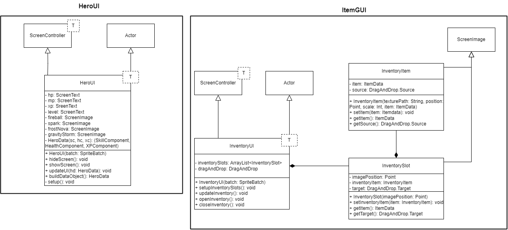

# HeroUI und InventarGUI

---

## Beschreibung der Aufgabe

### InventarGUI

Es soll ein Inventar-GUI implementiert werden,
mit dem der Spieler sein Inventar verwalten kann. Das Inventar soll mit einem hotkey geöffnet
werden und das Spiel soll dabei pausiert werden.

### HeroUI

Es soll ein Spieler HUD erstellt werden, welches dem Spieler seine Lebenspunkte, Manapunkte,
aktuelle XP, aktuelles Level und Skills mit cooldown anzeigt.

---

## Beschreibung der Lösung

### InventarGUI

Das Inventar kann mit dem Hotkey "i" geöffnet und geschlossen werden.

Items können per Drag & Drop im Inventar bewegt werden. Wenn ein Item außerhalb des Inventars gezogen
wird, wird es gedroppt.

Wenn der Spieler mit der Maus über ein Item hovered, wird der Name und der Beschreibungstext angezeigt.

Mit Rechtsklick wird ein Kontextmenü vom Item geöffnet.
Dort sieht man alle Optionen, die auf das Item angewendet werden können wie z.B. use oder drop.

Items können außerdem im Inventar mit Doppelklick benutzt werden.

### HeroUI

Lebenspunkte, Manapunkte usw. werden in Form von Leisten unten rechts im Spiel angezeigt. Die Skillslots
und der Equipmentslot werden unten rechts über den Leisten angezeigt. Wenn ein Skill auf cooldown ist,
wird er ausgegraut und es wird ein Timer angezeigt, der die Zeit bis zum Ende des cooldowns anzeigt. Alle
Komponenten des HUDs werden jeden Frame aktualisiert damit sie immer aktuell sind.

 

Wenn der Spieler ein Monster tötet oder ein Item aufsammelt, wird oben links im HeroUI kurz angezeigt,
wie viel XP der Spieler bekommen hat oder welches Item er aufgesammelt hat.

Beim Lösen der Aufgaben werden die Issues [#234](https://github.com/Programmiermethoden/Dungeon/issues/234) und [#329](https://github.com/Programmiermethoden/Dungeon/issues/329) als Inspiration genommen.

---

## Methoden und Techniken

Methoden werden wieder gemäß der Vorlesung mit Javadoc dokumentiert.

Für die Versionskontrolle wird Git verwendet.

Immer wenn ein item aufgesammelt wird, wird dieses geloggt.

---

## Ansatz und Modellierung

### InventarGUI

Damit Items im Inventar per Drag & Drop bewegt werden können, benutzten wir die Klasse
``DragAndDrop`` aus der Bibliothek gdx. Dort kann man Actors als ``Source`` und ``Target`` definieren.

Unsere Targets, also wo die items gedropped wenden können, werden Inventar Slots sein. Dafür erstellen wir
eine neue Klasse ``InventarSlot`` die von ScreenImage erbt und eine Position hat. Die Klasse wird dann als
DragAndDrop Target definiert damit dort Items hineingezogen werden können.

Unsere Sources, also Items die man ziehen kann, werden mit der Klasse ``InventarItem`` erstellt. Die Klasse
erbt ebenfalls von ScreenImage und erwartet ein Item und eine Position als Parameter. Außerdem wird die Klasse als DragAndDrop
Source definiert, damit man die Items ziehen kann.

Um man den Namen und den Beschreibungstext vom Item sehen zu können, wenn man über das Item mit der Maus hovered,
implementieren wir ein ``ClickListener`` in der ``InventoryItem`` Klasse. Von der Klasse ``ClickListener`` überschreiben wir
die Methoden ``enter()`` und ``exit()``, die ausgeführt werden wenn die Maus über das InventoryItem geht und wenn
sie wieder raus geht.

Die Klasse ``ClickListener`` hat außerdem die Methode ``clicked()`` die jedes Mal ausgeführt wird wenn das InventoryItem angeklickt wird.
In dieser Methode kann man ``getTapCount()`` aufrufen um zu gucken wie oft der Actor hintereinander angeklickt wurde.

Für das Kontextmenü muss außerdem noch ein ``ClickListener`` erstellt werden, der nur auf Rechtsklicks achtet.
Dort kann die Methode ``clicked()`` überschrieben werden.

 

### HeroUI

Es gibt eine neue Klasse ``HeroUI`` die das HUD verwaltet, diese erbt von
dem bereits vorgegebenen ``ScreenController``.

Die Klasse hat folgende Attribute:

- ``ScreenText level``: ScreenText für das aktuelle Hero Level.
- ``ScreenImage equipmentSlot, skillSlot1, skillSlot2, hpBar, manaBar, xpBar``: ScreenImages für den Equipment Slot,
die Skills und die Leisten.

Abgesehen davon soll die Klasse auch noch einen record ``HeroData`` haben, welcher den
SkillComponent, HealthComponent und XPComponent des Spielers enthält.

In der Klasse wird es außerdem noch folgende
neue Methoden geben:

- ``HeroUI()``: Konstruktor der Klasse, ruft alle nötigen Methoden zum setup des
  HUDs auf.
- ``hideScreen()``: Versteckt das HUD.
- ``showScreen()``: Zeigt das HUD an.
- ``setup()``: Erstellt alle ScreenTexte und ScreenImages und fügt sie dem Controller
  hinzu.
- ``buildDataObject()``: Gibt das HeroData Objekt mit den Components des Spielers zurück.
- ``updateUI()``: Aktualisiert alle ScreenTexte und ScreenImages mit den aktuellen Werten.

---

## UML

